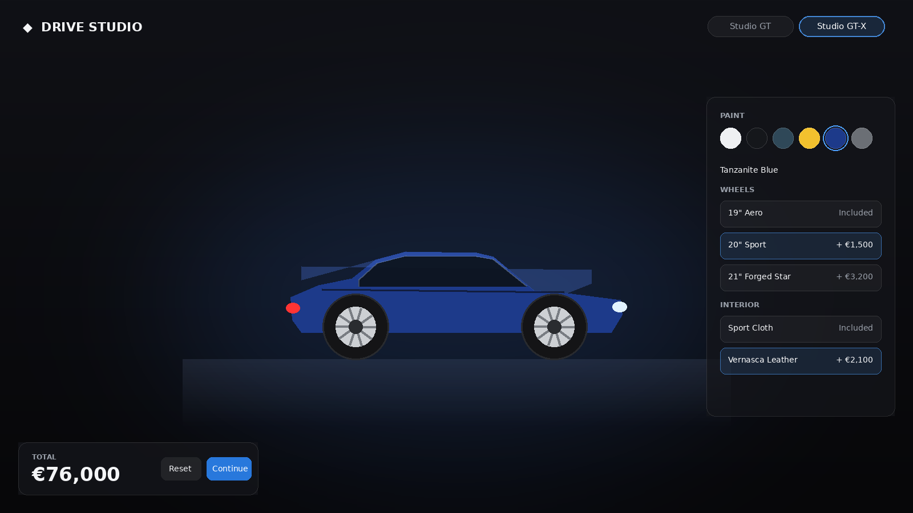

# Drive Studio — 3D Car Configurator

A premium, real-time **3D car configurator** built with **React + Vite + Three.js** (react-three-fiber). Pick paint, wheels, interior trim and option packages and watch the car — and the price — update live in a studio-lit WebGL scene.

Built as a focused showcase of automotive-grade frontend work: real-time 3D, motion design, clean state architecture and a real test pyramid.

   

## Preview



> UI preview. Run `npm run dev` for the live 3D scene — feel free to replace this with a real screenshot once it's running.

---

## Highlights

- **Live 3D rendering** — a bundled low-poly car model (`ObjCar`) is the default, with a fully procedural car as automatic fallback. Every choice updates instantly: paint colour + finish (gloss / metallic / matte via physically-based materials), wheel design, interior accent, and body packages (M Sport spoiler, carbon roof).
- **Motion that feels premium** — GSAP drives the cinematic camera fly-in, the price count-up, the car entrance and the wheel-swap "pop". Auto-orbit idles the camera; OrbitControls hands it to the user on grab.
- **Performance-aware** — `PerformanceMonitor` + `AdaptiveDpr` scale the pixel ratio to the GPU, the 3D libraries are code-split into their own chunk, and all animation runs on the GPU-friendly `transform`/material props rather than layout.
- **Accessible** — honours `prefers-reduced-motion` (skips the camera sweep, disables auto-rotate), uses real buttons with `aria-pressed`, and is keyboard-navigable.
- **Clean architecture** — one declarative config file feeds the UI, the 3D scene and a pure pricing function. State lives in a small Zustand store with selector-based subscriptions.
- **Tested** — Vitest unit tests for the pricing logic and store; Playwright end-to-end specs for the configurator flow (desktop + mobile projects).

---

## Tech stack

| Concern | Choice | Why |
| --- | --- | --- |
| Build/dev | Vite 5 | Instant HMR, simple config, fast prod builds |
| UI | React 18 | Component model the role asks for |
| 3D | Three.js + react-three-fiber + drei | Declarative 3D inside React; drei removes boilerplate |
| Animation | GSAP | Best-in-class timeline control for camera + UI motion |
| State | Zustand | Tiny, selector-based, no boilerplate or context churn |
| Unit tests | Vitest | Vite-native, Jest-compatible API |
| E2E tests | Playwright | Cross-browser, auto-starts the dev server |

---

## Getting started

```bash
npm install        # install dependencies
npm run dev        # start the dev server at http://localhost:5173
npm run build      # production build to /dist
npm run preview    # preview the production build
```

## Testing

```bash
npm test           # run unit tests (Vitest)
npm run test:watch # watch mode
npm run test:e2e   # run Playwright end-to-end tests (installs browsers on first run)
```

> First Playwright run: `npx playwright install` to download browsers.

---

## Project structure

```
src/
├── data/
│   └── carConfig.js          # single source of truth: models, paints, wheels, trims, packages
├── store/
│   └── useConfigurator.js    # Zustand store + derived price
├── utils/
│   ├── pricing.js            # pure price calculation (fully unit-tested)
│   └── format.js             # currency formatting
├── hooks/
│   └── usePrefersReducedMotion.js
├── components/
│   ├── Scene/                # the WebGL world
│   │   ├── CarScene.jsx      # <Canvas> root, perf scaling, fog/background
│   │   ├── ObjCar.jsx        # bundled OBJ model loader (DEFAULT; falls back to CarModel)
│   │   ├── GltfCar.jsx       # optional .glb loader (falls back to CarModel)
│   │   ├── CarModel.jsx      # procedural sculpted sedan; paint/trim/packages react to state
│   │   ├── Wheel.jsx         # procedural wheel (spoke count + radius from config)
│   │   ├── CameraRig.jsx     # GSAP intro sweep + OrbitControls
│   │   ├── Lighting.jsx      # three-point studio lighting + HDRI env
│   │   └── Ground.jsx        # reflective floor + contact shadows
│   └── UI/                   # the 2D overlay
│       ├── Header.jsx        # brand + model switch
│       ├── ConfiguratorPanel.jsx
│       ├── PriceBar.jsx      # GSAP price count-up + reset
│       └── Loader.jsx
├── __tests__/                # Vitest unit tests
├── App.jsx
└── main.jsx
public/models/                # 3D assets + drop-in guide
e2e/                          # Playwright specs
```

---

## How a few of the effects work

**Paint finish → material.** Each paint defines a `finish` (`gloss` / `metallic` / `matte`). The renderer maps that to `MeshPhysicalMaterial` params — gloss gets full `clearcoat`, metallic raises `metalness` and lowers `roughness`, matte kills the clearcoat and pushes roughness high. The HDRI environment is what makes metallic actually read as metallic.

**Live price.** `calculatePrice()` is a pure function over the current config. The Zustand store recomputes it on every mutation and caches it, so the `PriceBar` just subscribes to `price.total` and GSAP tweens the displayed number.

**Wheel swaps.** Each wheel is keyed by its id, so switching wheels remounts the component and replays a `back.out` scale-in — the change feels physical instead of instant.

**Performance scaling.** `PerformanceMonitor` watches the frame rate and nudges the canvas DPR up on strong GPUs / down on weak ones, so the experience degrades gracefully instead of dropping frames.

---

## Possible next steps

- Replace the low-poly OBJ with a higher-quality licensed glTF model (Draco-compressed, `useGLTF` preloaded).
- Add a "share build" URL that encodes the config in query params.
- Post-processing pass (SSAO + bloom on the lights) behind a quality toggle.
- Persist the last configuration to `localStorage`.

---

## Using a real 3D model

A real low-poly model (`public/models/car1/car1.obj`) ships with the project and is the **default** — loaded by `ObjCar.jsx`, auto-centred and scaled, with the body recoloured live from the paint picker. If it fails to load it falls back to the procedural car. A `GltfCar.jsx` loader is also provided for dropping in a `.glb`. Full details in [`public/models/README.md`](public/models/README.md).

T